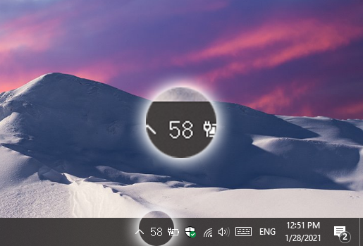
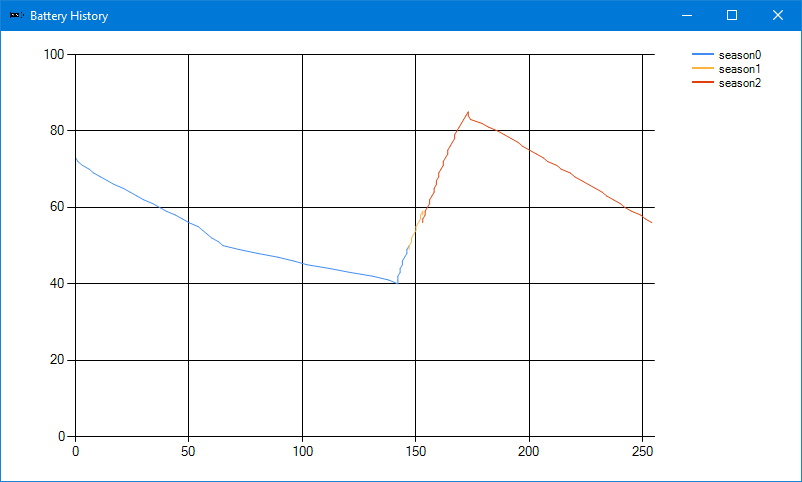
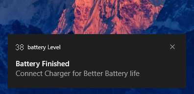

# battery Level

## Icon

App gives you numbric Battery icon like this

Updated real time with only less than 6 mb RAM usage

## History

with history of your battery usage

seasons doesn't count if laptop turned off

## Notifications

Notifications when battery below 40% / above 80%

So you notice and connect/disconnect charger

TODO :  make notification percent customizable